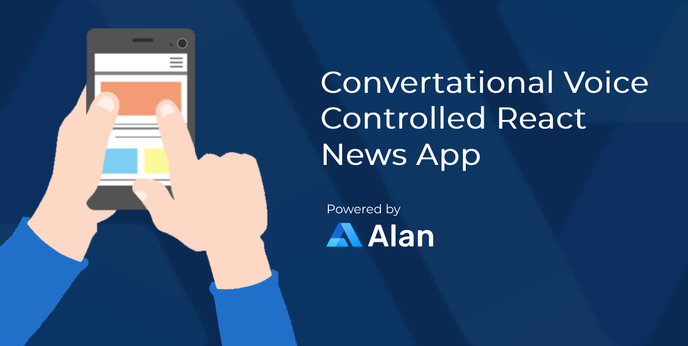

## News webapp using Alan AI

## Table of Contents

- [Introduction](#introduction)
- [Features](#features)
- [Build Process](#build-process)
- [Tech Stack](#tech-stack)

 

## Introduction

This is a conversational voice controlled news app which was build using react and alan ai. This app can navigate through pages and give voice commands using alan's sdk.

#### Some of the commands to read news (Try saying:)
- Give me the latest news
- Give me the latest Technology news
- What's up with PlayStation 5
- Give me the news from CNN

## Features

🚀 Read News  
🚀 Navigate through pages and news using voice

## Build Process

- Clone or download the repo
- Add `NEXT_PUBLIC_SECRET_KEY=<<YOUR_ALAN_KEY>>` to the env.local
- `npm install` or `yarn` to install dependencies
- `npm start` or `yarn run dev` to run the application

## Tech Stack

    
    
    
    

## Project Goals & Outcomes

✔️ Learning React JS & Next JS  
✔️ Learning How Conversational AI Works  
✔️ Learning Alan AI & Intents.